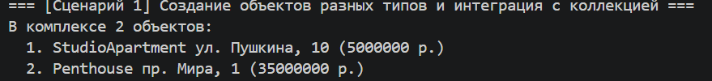
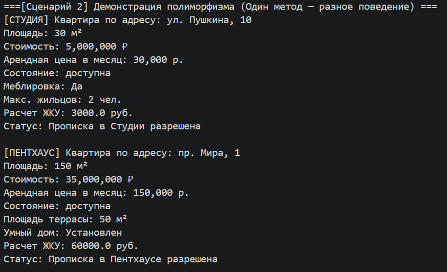
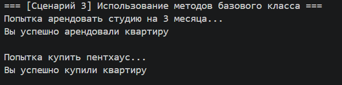
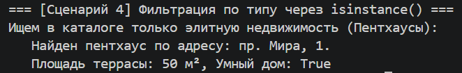

# Лабораторная работа №3

## 1. Цель работы

Изучение базовых концепций объектно-ориентированного проектирования: наследования и полиморфизма. Разработка иерархии классов на основе абстрактного базового класса (ABC), интеграция с ранее созданной коллекцией (ЛР-2) и реализация уникального поведения для дочерних классов при сохранении единого интерфейса взаимодействия.

---

## 2. Описание реализованной иерархии классов

**Описание:**

*   **Базового класса:**
    Абстрактный класс `Apartment` описывает общую сущность жилой недвижимости. В нем инкапсулированы базовые атрибуты (цена, арендная плата, адрес, площадь, доступность) и реализована общая бизнес-логика (`buy`, `rent`). Для обеспечения полиморфизма в классе заданы абстрактные методы `calculate_utility_bills()` и `check_registration()`, обязывающие наследников реализовать собственную логику расчетов.

*   **Дочерних классов:**
    *   `StudioApartment` (Квартира-студия) — компактное жилье, наследующее свойства базовой квартиры.
    *   `Penthouse` (Пентхаус) — элитная недвижимость с особыми условиями обслуживания.

*   **Различий между ними:**
    *   **Атрибуты:** Студия имеет параметры меблировки (`is_furnished`) и максимального числа жильцов (`max_tenants`). Пентхаус выделяется наличием террасы (`terrace_square`) и системы «Умный дом» (`has_smart_home`). Все новые атрибуты реализованы как *read-only* через декоратор `@property`.
    *   **Полиморфизм (Коммунальные платежи):** Для студии `calculate_utility_bills()` возвращает расчет по сниженному тарифу (100 руб/м²). Пентхаус имеет сложный расчет с гигантскими наценками за террасу и абонентской платой за умный дом.
    *   **Полиморфизм (Строковое представление):** Каждый класс переопределяет метод `__str__`, вызывая родительский `super().__str__()` и добавляя к выводу свои уникальные характеристики.

---

## 3. Демонстрация работы

Описание сценариев из `demo.py`:

*   **Сценарий 1: Интеграция с коллекцией.** Успешное создание объектов разных типов (`StudioApartment`, `Penthouse`) и добавление их в единую коллекцию-контейнер `ResidentialComplex` (работа с разными типами через одну коллекцию).

*   **Сценарий 2: Вызов одного метода — разное поведение (Полиморфизм).** Программа единым циклом перебирает список объектов разных типов. При вызове абстрактных методов `calculate_utility_bills()` и `check_registration()` система динамически подбирает нужную реализацию, рассчитывая льготную коммуналку для студии и элитную — для пентхауса. Также происходит полиморфный вывод объектов на экран.

*   **Сценарий 3: Использование методов базового класса.** Демонстрация того, что дочерние классы успешно унаследовали бизнес-логику родителя: вызываются методы `rent()` для студии и `buy()` для пентхауса с изменением их статусов доступности.

*   **Сценарий 4: Фильтрация по типу.** Использование встроенной функции `isinstance()` для перебора общей коллекции и поиска объектов строго определенного дочернего типа (вывод информации только о пентхаусах с обращением к их уникальным атрибутам).

---

## 4. Вывод

Что было изучено:

*   **Наследование:** механизм вынесения общих полей и методов в родительский класс для соблюдения принципа DRY. Применение функции `super()` для безопасного и лаконичного расширения родительского конструктора и строкового представления. Использование модуля `abc` для создания защищенного абстрактного базового класса.
*   **Полиморфизм:** реализация единого интерфейса взаимодействия для массива разнородных объектов. Продемонстрировано, что вызывающему коду (циклу в `demo.py`) не нужно знать конкретный подкласс для корректной работы математики. Также закреплен навык применения `isinstance()` для фильтрации объектов, когда требуется доступ к специфичным атрибутам дочерних классов.