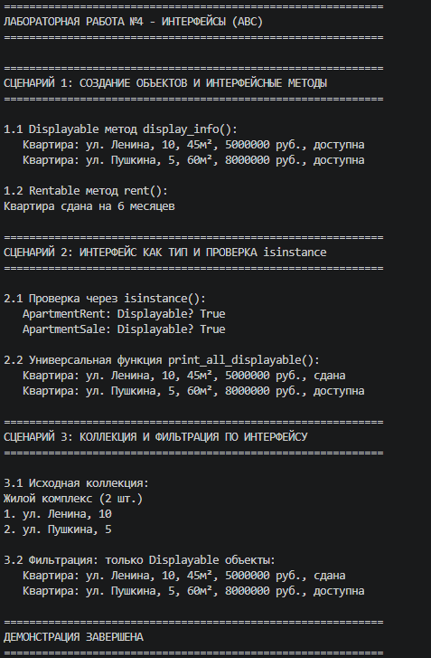

# Лабораторная работа №4

## 1. Цель работы

Изучение абстрактных базовых классов (ABC) и интерфейсов в Python. Освоение принципов создания контрактов поведения, обязательных для реализации в дочерних классах. Закрепление полиморфизма через единый интерфейс и интеграция интерфейсов с существующей коллекцией объектов.

---

## 2. Описание интерфейсов

**Интерфейс Displayable:**
Интерфейс для объектов, которые могут отображать информацию о себе. Содержит абстрактный метод `display_info()`, возвращающий строковое представление объекта. Реализуется всеми классами, которым необходимо предоставить унифицированный способ вывода информации.

**Интерфейс Rentable:**
Интерфейс для объектов, которые могут быть сданы в аренду. Содержит абстрактные методы:
- `rent(months, money)` — сдача в аренду с проверкой средств
- `calculate_utility_bills()` — расчёт коммунальных платежей
- `check_registration()` — проверка возможности регистрации

---

## 3. Реализация в классах

**Класс ApartmentRent (наследник Apartment + Displayable + Rentable):**
- Реализует оба интерфейса полностью
- `display_info()`: возвращает информацию о квартире (адрес, площадь, цена, статус)
- `rent()`: проверяет доступность и средства, сдаёт квартиру
- `calculate_utility_bills()`: расчёт по базовому тарифу (площадь × 50)
- `check_registration()`: всегда возвращает True (регистрация возможна)

**Класс ApartmentSale (наследник Apartment + Displayable):**
- Реализует только интерфейс Displayable (не может сдаваться)
- `display_info()`: возвращает информацию о квартире с указанием статуса продажи
- `calculate_utility_bills()`: расчёт коммунальных услуг
- `check_registration()`: проверка регистрации

**Различия в поведении:**
- `ApartmentRent` поддерживает аренду (метод `rent`)
- `ApartmentSale` не реализует `Rentable`, поэтому не может быть сдан
- Оба класса имеют единый интерфейс `Displayable` для унифицированного вывода

---

## 4. Демонстрация работы

Описание сценариев из `demo.py`:

**Сценарий 1: Создание объектов и интерфейсные методы**
Демонстрируется создание объектов разных типов (`ApartmentRent` и `ApartmentSale`), вызов метода `display_info()` из интерфейса `Displayable` и метода `rent()` из интерфейса `Rentable` для арендуемой квартиры.

**Сценарий 2: Интерфейс как тип и проверка isinstance**
Демонстрируется проверка типов через `isinstance()` и работа универсальной функции `print_all_displayable()`, которая принимает список любых объектов и вызывает у них `display_info()`, если они реализуют интерфейс `Displayable`.

**Сценарий 3: Коллекция и фильтрация по интерфейсу**
Демонстрируется работа коллекции `ResidentialComplex` с объектами разных типов. Метод `get_displayable()` фильтрует коллекцию, возвращая только объекты, реализующие интерфейс `Displayable`.

---

## 5. Вывод

Что было изучено:

- **Абстрактные классы и интерфейсы:** создание контрактов поведения через `ABC` и `@abstractmethod`. Интерфейс задаёт обязательный набор методов, которые должны быть реализованы в дочерних классах.

- **Множественная реализация интерфейсов:** класс `ApartmentRent` одновременно реализует два интерфейса (`Displayable` и `Rentable`), демонстрируя гибкость Python в работе с множественным наследованием.

- **Полиморфизм через интерфейс:** универсальная функция `print_all_displayable()` работает с любыми объектами, реализующими `Displayable`, не требуя проверки конкретного типа.

- **Фильтрация коллекции по интерфейсу:** метод `get_displayable()` позволяет отбирать объекты, обладающие определёнными способностями, что упрощает работу с разнородными коллекциями.

- **Проверка через `isinstance()`:** подтверждение принадлежности объекта интерфейсу для безопасного вызова методов.