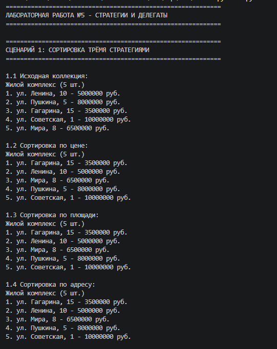

# Лабораторная работа №5

## 1. Цель работы

Освоение передачи функций как аргументов, функций высшего порядка (map, filter), lambda-выражений, паттерна «Стратегия» и callable-объектов.

---

## 2. Реализованные функции и стратегии

**Стратегии сортировки (3 шт.):**

| Стратегия | Назначение |
|-----------|------------|
| `by_price` | Сортировка по цене |
| `by_square` | Сортировка по площади |
| `by_address` | Сортировка по адресу |

**Функции-фильтры (2 шт.):**

| Фильтр | Назначение |
|--------|------------|
| `is_available` | Оставляет только доступные квартиры |
| `is_expensive` | Оставляет только дорогие квартиры (цена > 6000000) |

**Фабрика функций:**

| Функция | Описание |
|---------|----------|
| `make_price_filter(max_price)` | Создаёт фильтр по максимальной цене |

**Callable-объект:**

| Класс | Описание |
|-------|----------|
| `DiscountStrategy` | Стратегия для применения скидки (хранит процент скидки) |

**Методы коллекции:**

| Метод | Описание |
|-------|----------|
| `sort_by(key_func, reverse)` | Сортировка по переданной стратегии |
| `filter_by(predicate)` | Фильтрация по переданному условию |
| `apply(func)` | Применение функции к каждому элементу |
| `copy()` | Создание копии коллекции |

---

## 3. Демонстрация работы

### Сценарий 1: Сортировка тремя стратегиями

Демонстрируется сортировка одной коллекции тремя разными способами: по цене, по площади и по адресу.

---

### Сценарий 2: Фильтрация двумя функциями

Демонстрируется фильтрация коллекции через `filter()` с функциями `is_available` и `is_expensive`.

---

### Сценарий 3: Map, цепочка операций и callable-объект

Демонстрируется:
- Применение `map()` с lambda-выражением
- Фабрика функций `make_price_filter`
- Цепочка операций `filter_by → sort_by → apply`
- Callable-объект `DiscountStrategy`
- Сортировка через lambda

---

## 4. Вывод

В ходе выполнения лабораторной работы №5 были изучены и реализованы:

1. **Передача функций как аргументов** — стратегии сортировки и фильтрации
2. **Функции высшего порядка** — `map()`, `filter()`
3. **Lambda-выражения** — короткие анонимные функции
4. **Фабрика функций** — функция, создающая другую функцию (замыкание)
5. **Callable-объекты** — классы с методом `__call__`, хранящие состояние
6. **Паттерн «Стратегия»** — взаимозаменяемое поведение через передачу функций
7. **Цепочки операций** — последовательные вызовы методов, возвращающих `self`

