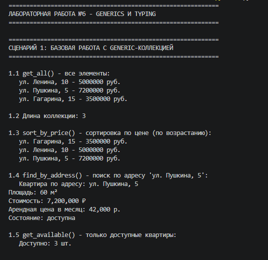

# Лабораторная работа №6

## 1. Цель работы

Освоение системы аннотаций типов (typing), создание обобщённых (generic) коллекций с помощью TypeVar и Generic, понимание структурной типизации через Protocol.

## 2. Реализованные типы и контейнеры

### Generic-коллекция TypedCollection[T]

Обобщённая версия коллекции из ЛР-2 (ResidentialComplex). Хранит объекты любого типа T, но сохраняет информацию о типе.

**Методы коллекции (все из ЛР-2 + новые):**

| Метод | Описание |
|-------|----------|
| add(item) | добавить элемент |
| remove(item) | удалить элемент |
| remove_at(index) | удалить по индексу |
| get_all() | получить копию списка |
| clear() | очистить коллекцию |
| find_by_address(address) | поиск по адресу |
| find_by_price_range(min,max) | поиск по диапазону цен |
| find_by_square(min,max) | поиск по площади |
| sort_by_price(reverse) | сортировка по цене |
| sort_by_square(reverse) | сортировка по площади |
| get_available() | только доступные квартиры |
| filter_by_min_level(level) | фильтр по уровню |
| find(predicate) | первый элемент по условию |
| filter(predicate) | все элементы по условию |
| map(transform) | преобразование с изменением типа |
| __len__, __iter__, __getitem__, __contains__, __str__, __repr__ | магические методы |

### Protocols (структурные интерфейсы)

| Protocol | Метод | Требование |
|----------|-------|-------------|
| Displayable | display() -> str | объект можно отобразить |
| Scorable | score() -> float | объект можно оценить |

Ограничения:
D = TypeVar('D', bound=Displayable)
S = TypeVar('S', bound=Scorable)

### TypeVar

| Переменная | Назначение |
|------------|-----------|
| T | любой тип |
| D | только с методом display() |
| S | только с методом score() |
| R | тип результата преобразования |

## 3. Демонстрация работы

### Сценарий 1: базовые операции + поиск + сортировка

Создаётся TypedCollection[ApartmentRent], добавляются объекты, вызываются методы из ЛР-2.

### Сценарий 2: find, filter, map

Показывается:
- поиск первой квартиры дороже 6 млн (find)
- фильтрация квартир дороже 6 млн (filter)
- преобразование в адреса (map -> list[str])
- преобразование в цену в млн (map -> list[float])

### Сценарий 3: Protocols

Создаются коллекции с ограничениями Displayable и Scorable. У объектов вызываются методы display() и score().

## 4. Вывод

В ходе работы реализованы:

- Generic-коллекция с сохранением всех методов ЛР-2
- Аннотации типов для всех методов
- find / filter / map с корректной типизацией
- Protocol (утиная типизация без явного наследования)
- TypeVar с ограничениями (bound)
- Демонстрация изменения типа в map

