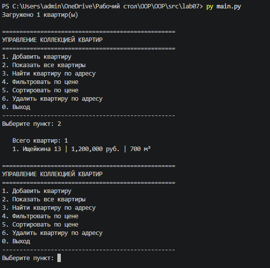

# Лабораторная работа №7

## 1. Цель работы

Разработать консольное приложение для управления коллекцией квартир, объединяющее все концепции из ЛР1-ЛР6: классы, коллекцию, наследование, интерфейсы, стратегии, generics, типизацию и работу с файлами.

## 2. Структура проекта

| Файл | Назначение |
|------|-----------|
| main.py | Точка входа, загрузка/сохранение, запуск CLI |
| cli.py | Меню, ввод/вывод, взаимодействие с пользователем |
| app.py | Бизнес-логика, операции над коллекцией |
| models.py | Импорт классов ApartmentRent |
| exceptions.py | Собственные исключения |
| storage.py | Сохранение и загрузка JSON |

## 3. Описание CLI

### Пункты меню

1. Добавить квартиру
2. Показать все квартиры
3. Найти квартиру по адресу
4. Фильтровать по цене
5. Сортировать по цене
6. Удалить квартиру по адресу
0. Выход

### Обработка ошибок

- При вводе букв вместо чисел - ValueError - повторный запрос
- При добавлении дубликата адреса - DuplicateApartmentError
- При удалении несуществующего адреса - ApartmentNotFoundError

### Сохранение/загрузка

- Файл apartments.json в папке запуска
- Автоматическая загрузка при старте
- Автоматическое сохранение при выходе

## 4. Демонстрация работы

### Сценарий 1: Запуск -> автозагрузка -> вывод коллекции

### Сценарий 2: Добавление -> удаление с подтверждением -> выход -> повторный запуск

### Сценарий 3: Сортировка по цене (по возрастанию/убыванию)

### Сценарий 4: Фильтрация по цене + перехват исключения дубликата

## 5. Вывод

В ходе работы изучены и реализованы:

- разбиение на модули и слои (cli, app, storage)
- CLI-интерфейс с обработкой ошибок ввода
- собственные исключения
- работа с файлами (JSON)
- типизация и docstring
- подтверждение опасных операций
